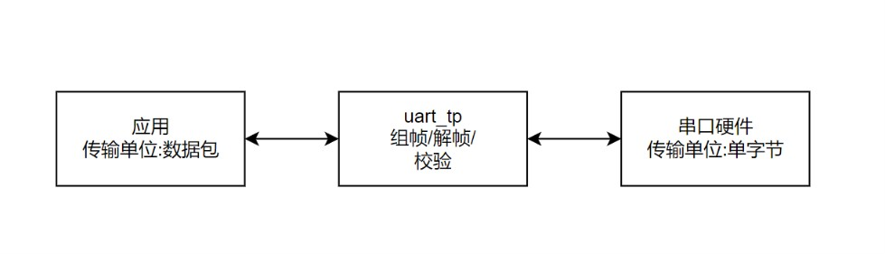
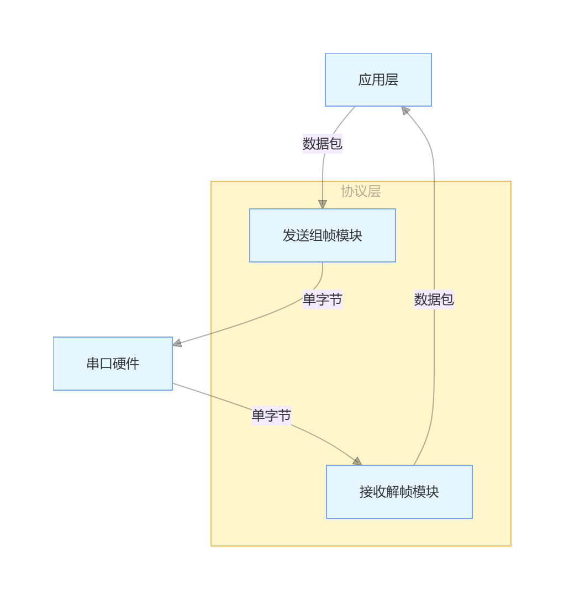
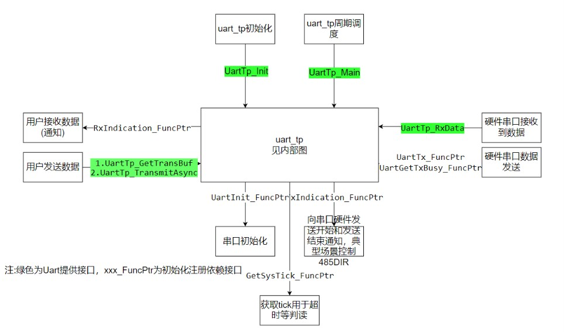
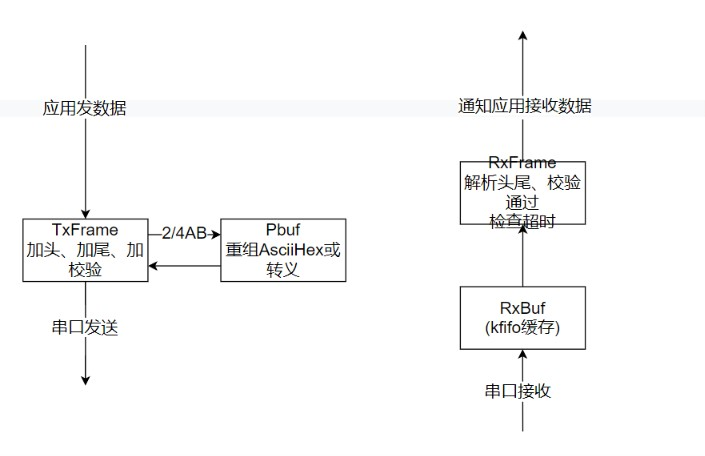

# module-uart_tp
    主仓：https://gitee.com/oldking-ecu
    镜像：https://github.com/oldking-ecu

#### 介绍

最全的串口通讯封包，rawhex、ascii，headmark/len/tailmark、转义、总有一款能满足你。设计目标如下：   
1.支持任意长度   
2.差帧自恢复   
3.传输效率高，性能好(内部采用无锁fifo，stm32串口速率跑到2M无压力)   
4.解析简单可靠   

##### 协议类型汇总表

| 类型 | 编码方式 | 头标记 | 尾标记 | 长度字段 | CRC16格式 |
|------|---------|--------|--------|---------|---------|
| INVT | RawHex | 无 | 无 | 无 | RawHex |
| 1A | RawHex | 0xAA55 | 0x55 | Len16 | RawHex |
| 1B | RawHex | 0x55AA | 无 | Len16 | RawHex |
| 2A | RawHex+转义 | 0x7E | 0x7E | 无 | RawHex |
| 2B | RawHex+转义 | 无 | 0x7E | 无 | RawHex |
| 3A | ASCII | 0x02 | 0x03 | 无 | ASCII(4Byte) |
| 3B | ASCII | 无 | 0x03 | 无 | ASCII(4Byte) |
| 4A | AsciiHex | '<' | '>' | 无 | ASCII(4Byte) |
| 4B | AsciiHex | 无 | '>' | 无 | ASCII(4Byte) |

注：   
1.CRC16和Len16统一为小端   
2.除了2A/2B类型，所有头尾内容、长度可自定义   

---

##### Type INVT (RawHex) - 基于时间间隔
###### 帧格式
```
[Data[n] Crc16] <--时间间隔--> [Data[n] Crc16] <--时间间隔--> ...
```
###### 特点说明
- 无头标记、无尾标记、无长度字段
- 通过时间间隔(Tms)来检测帧边界，对通讯响应速度有点影响
- 传输延迟会导致出错，适用于数据流连续传输的场景
- 典型应用MODBUS_RTU
---

##### Type 1A (RawHex) - 有头有尾带长度
###### 帧格式
```
HeadMark + Len16 + Data[n] + Crc16 + TailMark
```
##### Type 1B (RawHex) - 有头无尾带长度
###### 帧格式
```
HeadMark(0x55AA) + Len16 + Data[n] + Crc16
```
###### 特点说明
- 尾标记可用于冗余检查，避免Len出错且Crc凑上情况
- 该协议在串口自定义协议中应用最广泛
---

##### Type 2A (RawHex+转义) - 转义方案有头有尾
###### 帧格式
```
0x7E + [转义Data+Crc16] + 0x7E
```
##### Type 2B (RawHex+转义) - 转义方案无头有尾
###### 帧格式
```
[转义Data+Crc16] + 0x7E
```
###### 转义规则表
| 原始字节 | 转义后字节 |
|---------|-----------|
| 0x7E | 0x7D 0x02 |
| 0x7D | 0x7D 0x01 |
###### 特点说明
- 头标记和尾标记固定为0x7E
- 数据和CRC中的特殊字节需要转义
- 转义方案确保帧边界清晰
- 适用于数据中可能包含0x7E或0x7D的场景
- 典型应用JT/T808：7E dataN Xor_chk 7E (7E = 7D02;7D=7D01)
---

##### Type 3A (ASCII) - ASCII传输有头有尾
###### 帧格式
```
0x02 + ASCII_Data + CRC16(ASCII,4Byte) + 0x03
```
##### Type 3B (ASCII) - ASCII传输无头有尾
###### 帧格式
```
ASCII_Data + CRC16(ASCII,4Byte) + 0x03
```
###### 特点说明
- 仅能传输字符ASCII数据
- CRC16为ASCII格式(4字节)，如'AABB'
- 有头标记(0x02)和尾标记(0x03)
- 适用于纯ASCII字符传输场景
---

##### Type 4A (0-9A-Z ASCII) - Hex转ASCII有头有尾
###### 帧格式
```
'<' + HexASCII_Data + CRC16(ASCII,4Byte) + '>'
```
##### Type 4B (0-9A-Z ASCII) - Hex转ASCII无头有尾
###### 帧格式
```
HexASCII_Data + CRC16(ASCII,4Byte) + '>' '<'
```
###### 数据转换示例
| 原始Hex数据 | 转换后ASCII字符串 |
|------------|-----------------|
| 0x00 0x11 | "0011" |
| 0xAA 0xBB | "AABB" |
| 0x12 0x34 0x56 | "123456" |
###### 特点说明
- 仅能传输偶数个0-9A-Z字符ASCII数据
- 原始Hex数据转换为ASCII字符串(每个字节转为2个字符)
- CRC16为ASCII格式(4字节)，如'AABB'
- 有头标记('<')和尾标记('>')
- 典型应用FX编程协议:02 dataN 03 Sum_check
---

##### CRC16计算说明
###### CRC16算法
- 使用Modbus CRC16算法
- 初始值：0xFFFF
- 多项式：0x8005
---

##### 错误计数器说明
| 错误计数器 | 说明 | 适用类型 |
|-----------|------|---------|
| RxErrCntCrc | CRC校验失败计数 | 所有类型 |
| RxErrCntShor | 帧过短错误计数 | 所有类型 |
| RxErrCntLong | 帧过长错误计数 | 所有类型 |
| RxErrCntOdd | 数据长度为奇数错误 | 仅4A/4B类型 |
| RxErrCntContext | 数据内容非法错误(非0-9A-Z) | 仅4A/4B类型 |
---

##### 协议类型选择建议
| 应用场景 | 推荐类型 | 原因 |
|---------|---------|------|
| 高效可靠传输 | 1B | 帧结构简洁，有长度字段，无尾标记冗余 |
| 数据包含特殊字符 | 2A/2B | 转义方案确保帧边界清晰 |
| ASCII调试场景 | 3A/3B | 数据可读性强，便于调试 |
| Hex数据可视化 | 4A/4B | Hex转ASCII，便于观察和记录 |
| 连续数据流 | INVT | 无帧边界标记，依赖时间间隔 |


#### 软件架构
##### 概要图   
##### 框架图

##### 内部图


#### 使用说明

#### 1.配置
对于每个实例，需要配置封包类型Type，配置串口UartId，串口中断接收buff及长度，接收帧buff及长度(避免浪费，根据实际应用中收到的最大帧长度),接收超时RxFmOverTimeMs(对于INVT类型是帧间隔)，接收帧回调RxIndication_FuncPtr，发送帧及长度(避免浪费，根据实际应用中发送的最大帧长度)，发送完成回调间隔TxFmInvtTimeMs（典型的应用485发送完成切换DIR为接收），完整如下:
```
/**
 * @brief 定义实例配置
 *
 */
static const MODULE_INS_CFG_TYPE(UartTp) MODULE_INS_CFG(UartTp)[MODULE_ENUM_NAME(UartTp, TOTAL_NUM)] = {
	{.Type = UARTTP_TYPE_INVT,
	 .UartId = MCU_UART_ONE,
	 .RxBuf = RxIsr,
	 .RxBufSz = sizeof(RxIsr),
	 .RxFmBuf = RxFrame,
	 .RxFmBufSz = sizeof(RxFrame),
	 .RxFmOverTimeMs = 3,
	 .RxIndication_FuncPtr = IapCmd_UserRecvPacketUart,
	 .TxFmBuf = TxFrame,
	 .TxFmBufSz = sizeof(TxFrame),
	 .TxFmInvtTimeMs = 3},
};
```
配置公共参数如下，每个参数含义见代码注释：
```
{
	static uint8 buff[1024];
	MODULE_CFG(UartTp).InsCfgPtr = MODULE_INS_CFG(UartTp);
	MODULE_CFG(UartTp).InsInfPtr = MODULE_INS_INF(UartTp);
	MODULE_CFG(UartTp).InsNum = ARRAY_SIZE(MODULE_INS_CFG(UartTp));
	MODULE_CFG(UartTp).Pbuff = buff;
	MODULE_CFG(UartTp).PbufSz = sizeof(buff);
	MODULE_CFG(UartTp).TxIndication_FuncPtr = NULL;
	MODULE_CFG(UartTp).GetSysTick_FuncPtr = Tim_GetTick;
	MODULE_CFG(UartTp).UartInit_FuncPtr = McuUart_UserInit;
	MODULE_CFG(UartTp).UartTx_FuncPtr = McuUart_TxSync;
	MODULE_CFG(UartTp).UartGetTxBusy_FuncPtr = NULL;
	MODULE_INIT_FUN(UartTp)
	(&MODULE_CFG(UartTp));
	Task_Creat(TASK_NOR, MODULE_MAIN_FUN(UartTp), 0);
```
完整的代码可以参考user_demo中代码。

#### 2.使用
##### 初始化   
先调用初始化UartTp_UserInit()，内部会注册周期UartTp_Main()；串口接收每个字节后调用void UartTp_RxData(uint8 ins, uint8 rxData)。   
##### 接收数据   
当模块收到校验通过的数据包会通过回调方式调用RxIndication_FuncPtr函数(配置单实例注册进去)；
##### 发送数据   
应用需要发送数据包，先调用UartTp_GetTransBuf获取发送的buff(可以理解申请发送buff)，然后赋值，最后调用UartTp_TransmitSync即可完成数据发送，具体可以参考user_demo中代码。

#### 参与贡献

1.  Fork 本仓库
2.  新建 Feat_xxx 分支
3.  提交代码
4.  新建 Pull Request


#### 支持本项目

若这个项目帮到了你，不妨点个星标~，愿意的话也可以小额捐赠，感谢每一份认可~~


#### 捐赠者致谢

感谢以下朋友支持(按捐赠时间排序)
1. XXX
